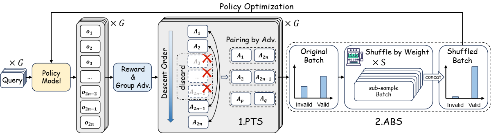
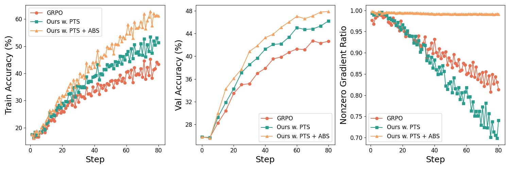

<div align="center">

# Shuffle-R1: Efficient RL framework for Multimodal Large Language Models via Data-centric Dynamic Shuffle

[](https://github.com/XenoZLH/Shuffle-R1)

</div>

Preview repository of **Shuffle-R1**.

## Introduction
Shuffle-R1 is a a simple yet principled framework that improves RL fine-tuning efficiency by dynamically restructuring trajectory sampling and batch composition. It introduces two key modules:

- **Pairwise Trajectory Sampling (PTS)**
- **Advantage-based Batch Shuffle (ABS)**

Experiments across multiple reasoning benchmarks demonstrate that our framework consistently outperforms strong RL baselines with minimal computational overhead. Specifically, Shuffle-R1 achieves superior performance against GRPO while using only half of the training steps under same settings.

**TL;DR:** We propose Shuffle-R1, a simple and effective RL post-training framework for MLLM that significantly improves RL training efficiency and model performance.

## Release
Our official code is undergoing internal review and is expected to be officially open-sourced within one to two weeks. We will open source model checkpoints, training data, training/inference/evaluation scripts and everything! Please stay tuned!
 - [ ] model checkpoints (3B and 7B)
 - [ ] datasets
 - [ ] training scripts
 - [ ] inference scripts via Transformers and vLLM
 - [ ] evaluation scripts


## Framework Overview


## Performance Overview
| Model | MathVerse | MathVision | MathVista (mini) | WeMath (loose) | HallusionBench | ChartQA | Avg. |
| :---: | :---: | :---: | :---: | :---: | :---: | :---: | :---: |
| Qwen2.5-VL-3B | 34.8 | 21.9 | 58.4 | 51.7 | 59.8 | 73.1 | 49.9 |
| Qwen2.5-VL-7B | 42.6 | 25.8 | 67.4 | 63.5 | 65.2 | 79.8 | 57.4 |
| Shuffle-R1-3B | 44.2 | 26.8 | 70.4 | 66.5 | 69.2 | 79.9 | 59.5 |
| Shuffle-R1-7B | 53.9 | 30.0 | 77.0 | 72.3 | 71.0 | 84.1 | 64.7 |

All models are evaluated under CoT prompt.

## Comparison with GRPO

 - **Left:** Training accuracy of Shuffle-R1 compared with GRPO. 
 - **Middle:** Validation accuracy of Shuffle-R1 compared with GRPO. Our framework achieves superior performance against GRPO with only half of the trainin steps. 
 - ***Right:** Rollouts ratio with nonzero gradient. Our framework maintains very high ratio throughout the training process, showing better data efficiency compared with GRPO.

## Try our model
Coming soon.

## Training
Coming soon.

## Evaluation
Coming soon.


## Acknowledgement
Our work benefit from the following open-source projects:
- [Qwen2.5](https://github.com/QwenLM/Qwen2.5)
- [EasyR1](https://github.com/hiyouga/EasyR1)
- [MM-EUREKA](https://github.com/ModalMinds/MM-EUREKA)
- [NoisyRollout](https://github.com/NUS-TRAIL/NoisyRollout)

## Citation
If you find our works useful for your research, please consider citing:
```

```